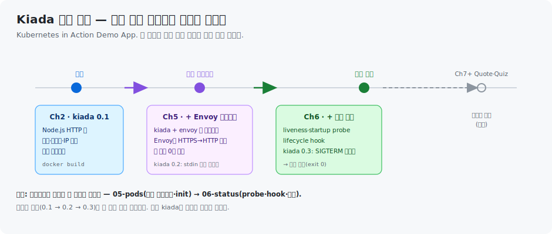

# k8s-in-action — Kubernetes in Action 실습

《Kubernetes in Action, 2판》(Marko Lukša, Manning)을 따라가며 손으로 만든 실습 코드 저장소입니다. 책의 예제 애플리케이션 **Kiada**(Kubernetes in Action Demo Application)를 Docker로 빌드·실행·배포하고, 이후 쿠버네티스로 확장하는 과정을 기록합니다.

학습 노트(개념 정리)는 별도 트리(`runners-high/write/08_cloud/book/kubernetes-in-action/`)에 있고, 이 저장소는 그 노트에 대응하는 **실제로 돌아가는 코드**를 담습니다.

## Kiada 앱은 챕터마다 자란다

이 책의 실습은 예제 앱 **Kiada**(Kubernetes in Action Demo Application) 하나를 잡고, 챕터를 지나며 기능을 더해 나갑니다. 새 앱을 매번 만드는 게 아니라 같은 앱에 컨테이너·probe·hook을 얹는 구조라, 실습 저장소의 디렉토리 순서가 곧 앱의 성장 순서입니다.



- **Ch2 `kiada 0.1`** — Node.js HTTP 앱. 버전·서버 호스트명·클라이언트 IP를 응답하는 단일 컨테이너로 출발합니다. Docker로 빌드·실행하는 첫 컨테이너입니다.
- **Ch5 `+ Envoy 사이드카`** — Node.js 앱은 HTTP만 하므로, 앱 코드를 한 줄도 고치지 않고 Envoy 프록시를 사이드카로 붙여 HTTPS를 처리합니다(멀티 컨테이너). 이 단계에서 `kiada 0.2`는 표준 입력으로 상태 메시지도 받습니다.
- **Ch6 `+ 건강 관리`** — liveness·startup probe로 죽거나 응답 못 하는 컨테이너를 재시작시키고, lifecycle hook으로 시작·종료 시점에 동작을 끼워 넣습니다. `kiada 0.3`은 SIGTERM 핸들러를 넣어 강제 종료(exit 137) 대신 곱게 종료(exit 0)됩니다.
- **Ch7+** — Quote·Quiz 같은 별도 서비스로 확장됩니다.

이미지 태그(`0.1 → 0.2 → 0.3`)가 곧 기능 추가 지점입니다. 아래 각 디렉토리는 이 흐름의 한 단계씩에 대응합니다.

## 구성

| 경로 | 내용 |
|------|------|
| `cluster/` | kind 실습 클러스터 정의(3노드) + 생성·삭제 스크립트 |
| `kiada-0.1/` | Ch2 §2.2 — Kiada 첫 버전. Node.js 웹 앱 + Dockerfile |
| `02-isolation/` | Ch2 §2.3 — 네임스페이스·cgroup 격리 실측 스크립트 |
| `03-deploy-scale/` | Ch3 §3.2 — kiada 이미지를 kind 클러스터에 배포·노출·스케일. 실습 명령 스크립트 |
| `04-fields/` | Ch4 §4.x — Node·Event 오브젝트로 보는 API 필드. conditions 리스트 설계·PIDPressure 커널 값 실측·Event 독립성 조회 스크립트 |
| `05-pods/` | Ch5 §5.2~5.6 — 멀티 컨테이너·init·네이티브 사이드카 실습. Envoy TLS 종료·생명주기·init(순차/실패)·stdin·종료 순서 매니페스트 6종 + 실습 스크립트 |
| `06-status/` | Ch6 §6.1 — Pod 상태(phase·conditions·컨테이너 상태). "Running인데 Ready=False" readiness 실습 매니페스트 + 조회 스크립트 |
| `07-namespaces/` | Ch7 §7.1 — namespace 이름 스코프·노드 공유·finalizer 삭제 장애 실습 |
| `07-labels/` | Ch7 §7.2~7.3 — label·selector·노드 스케줄링. app·rel 2차원 조직 + equality/set-based selector + nodeSelector/nodeAffinity 매니페스트 3종 + STEP 러너 |
| `08-config/` | Ch8 §8.1 — command·args·env 덮어쓰기, 변수 확장 순서, 셸과 PID 1 실습 |
| `08-configmap/` | Ch8 §8.2 — ConfigMap 생성·환경변수 주입·갱신·immutable 실습 |

## cluster — kind 실습 클러스터

Ch3부터의 쿠버네티스 실습에 쓰는 로컬 클러스터입니다. control-plane 1대 + worker 2대(3노드)로, worker를 둘 두어 **스케일 아웃 시 Pod 분산**과 **Service의 노드 경계 넘는 로드밸런싱**을 관찰할 수 있게 했습니다.

```
cluster/
├── kind-config.yaml   # 3노드 정의 (kindest/node:v1.35.0)
└── setup-cluster.sh   # create | load | delete
```

```bash
# 클러스터 생성 + kiada 이미지 로드까지 한 번에
./cluster/setup-cluster.sh create

# 이미지만 재로드 / 클러스터 삭제
./cluster/setup-cluster.sh load
./cluster/setup-cluster.sh delete
```

## kiada-0.1 — 첫 컨테이너

애플리케이션 버전·서버 호스트명·클라이언트 IP를 보여 주는 최소 웹 앱입니다. HTML 모드(`/html`)와 평문 모드(그 외 경로) 두 가지로 응답합니다.

```
kiada-0.1/
├── app.js            # Node.js HTTP 서버 (포트 8080)
├── html/index.html   # HTML 모드 정적 페이지
└── Dockerfile        # FROM node:23-alpine → COPY → ENTRYPOINT
```

### 빌드와 실행

```bash
cd kiada-0.1

# 1. 이미지 빌드 (-t 이름:태그, . 은 빌드 컨텍스트)
docker build -t kiada:latest .

# 2. 레이어 확인 — 지시문마다 레이어 하나
docker history kiada:latest

# 3. 컨테이너 실행 (호스트 1234 → 컨테이너 8080, 백그라운드)
docker run --name kiada-container -p 1234:8080 -d kiada

# 4. 응답 확인
curl localhost:1234          # 평문 모드
curl localhost:1234/html     # HTML 모드
# → Kiada version 0.1. Request processed by "<컨테이너ID>". Client IP: <IP>

# 5. 상태·로그
docker ps
docker logs kiada-container
```

### 레지스트리 배포

```bash
# Docker Hub 네이밍으로 재태깅 (yourid = 본인 Docker Hub ID)
docker tag kiada yourid/kiada:0.1
docker login -u yourid docker.io
docker push yourid/kiada:0.1

# 다른 호스트에서 그대로 실행
docker run --name kiada-container -p 1234:8080 -d yourid/kiada:0.1
```

### 생명주기

```bash
docker stop kiada-container    # 정지 (종료 신호 → 응답 없으면 kill)
docker start kiada-container   # 재개
docker rm kiada-container      # 컨테이너 삭제 (이미지는 남음)
docker rmi kiada:latest        # 이미지 삭제
```

## 02-isolation — 네임스페이스·cgroup 격리 확인

Ch2 §2.3의 "컨테이너 = 여러 네임스페이스가 배정된 프로세스"를 살아있는 컨테이너로 직접 확인합니다. 전 과정은 `02-isolation/inspect-namespaces-cgroups.sh`에 주석·실측값과 함께 있습니다.

```bash
# 두 컨테이너의 네임스페이스 번호를 대조 (다르면 격리, 같으면 공유)
for c in kiada-container web1; do
  docker exec "$c" sh -c 'for ns in uts pid net user time; do echo "$ns -> $(readlink /proc/1/ns/$ns)"; done'
done
#   uts/pid/net → 다름 = 격리,  user/time → 같음 = 공유(Docker 기본)

# cgroup: --memory 옵션이 커널 파일에 그대로 박힘
docker run -d --name cg-test --memory="100m" nginx:alpine
docker exec cg-test cat /sys/fs/cgroup/memory.max   # 104857600 (=100MB, 커널이 강제)
```

핵심: **네임스페이스는 "무엇을 볼 수 있나"(격리), cgroup은 "얼마나 쓸 수 있나"(제한)** 를 나눕니다. 두 컨테이너를 대조해야 격리(번호 다름)와 공유(번호 같음)가 증명됩니다.

## 03-deploy-scale — kind 클러스터에 배포·스케일

`kiada-0.1`에서 만든 이미지를 kind 클러스터(`k8s-lab`, control-plane 1 + worker 2)에 배포하고, Service로 노출한 뒤 3개로 스케일해 로드밸런싱까지 확인합니다. 전 과정은 `03-deploy-scale/deploy-scale.sh`에 주석과 함께 정리했습니다.

```
03-deploy-scale/
└── deploy-scale.sh   # 0.클러스터 확인 → 1.kind load → 2.배포 → 3.expose
                      #  → 4.접속 → 5.scale=3 → 6.로드밸런싱 → 7.정리
```

### 흐름 요약

```bash
# 1. 로컬 이미지를 kind 노드로 (자동으로 안 보이므로 필수)
kind load docker-image kiada:0.1 --name k8s-lab

# 2. 배포 → 3. Service 노출 → 5. 스케일
kubectl create deployment kiada --image=kiada:0.1
kubectl expose deployment kiada --port=8080 --target-port=8080
kubectl scale deployment kiada --replicas=3

# 6. 클러스터 안에서 로드밸런싱 확인 (port-forward 는 우회하므로 X)
kubectl run curl-test --image=curlimages/curl --rm -it --restart=Never -- \
  sh -c 'for i in $(seq 1 30); do curl -s http://kiada:8080/ | grep -oE "kiada-[a-z0-9-]+"; done | sort | uniq -c'
```

### 실습에서 부딪힌 함정 세 가지

| # | 증상 | 원인·해결 |
|---|------|-----------|
| ① | `kind load` 했는데도 `ErrImagePull` | 배포 태그(`:0.1`)와 로드한 태그(`:latest`) 불일치. 배포에 쓸 태그를 정확히 로드 |
| ② | `pull access denied` | `:latest`는 기본 `imagePullPolicy=Always` → 로컬 무시하고 Hub로 감. `:0.1` + `IfNotPresent` 사용 |
| ③ | `curl` 30번이 전부 같은 Pod로 | `port-forward`는 Pod 하나에 직접 터널(로드밸런싱 우회). 클러스터 안에서 ClusterIP로 요청해야 분산됨 |

## 출처

- 《Kubernetes in Action, Second Edition》(Marko Lukša, Manning, 2025)
- 예제 원본: [luksa/kubernetes-in-action-2nd-edition](https://github.com/luksa/kubernetes-in-action-2nd-edition)
